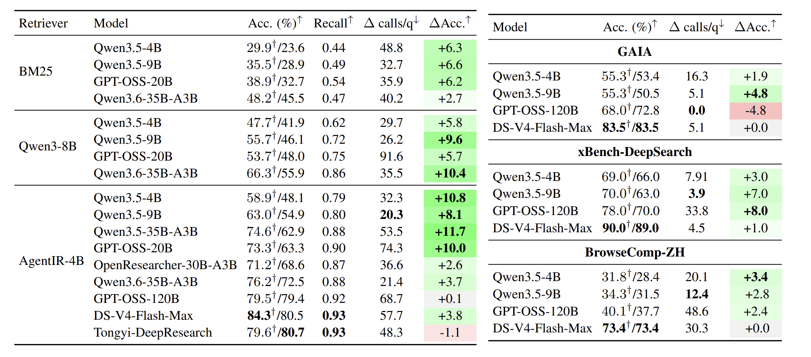
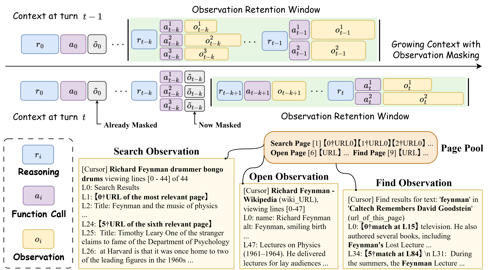
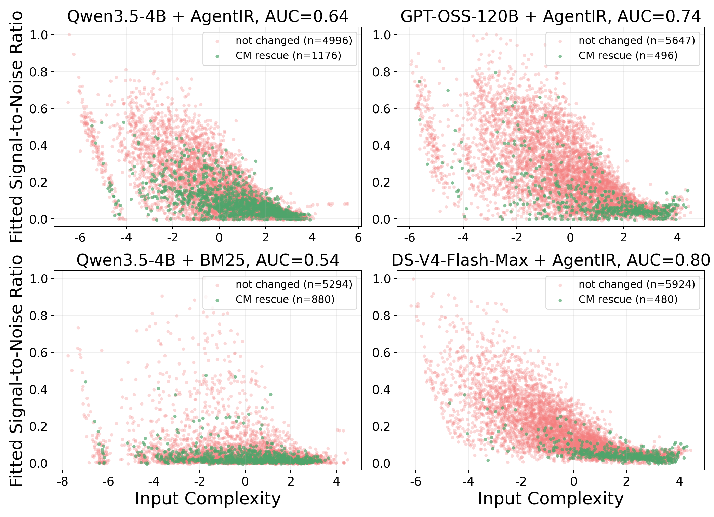
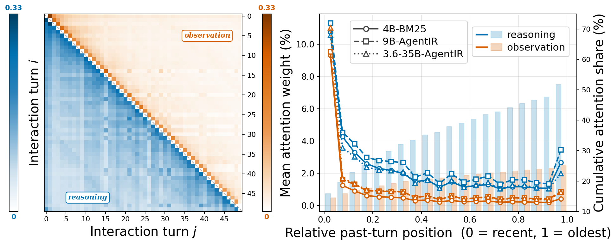
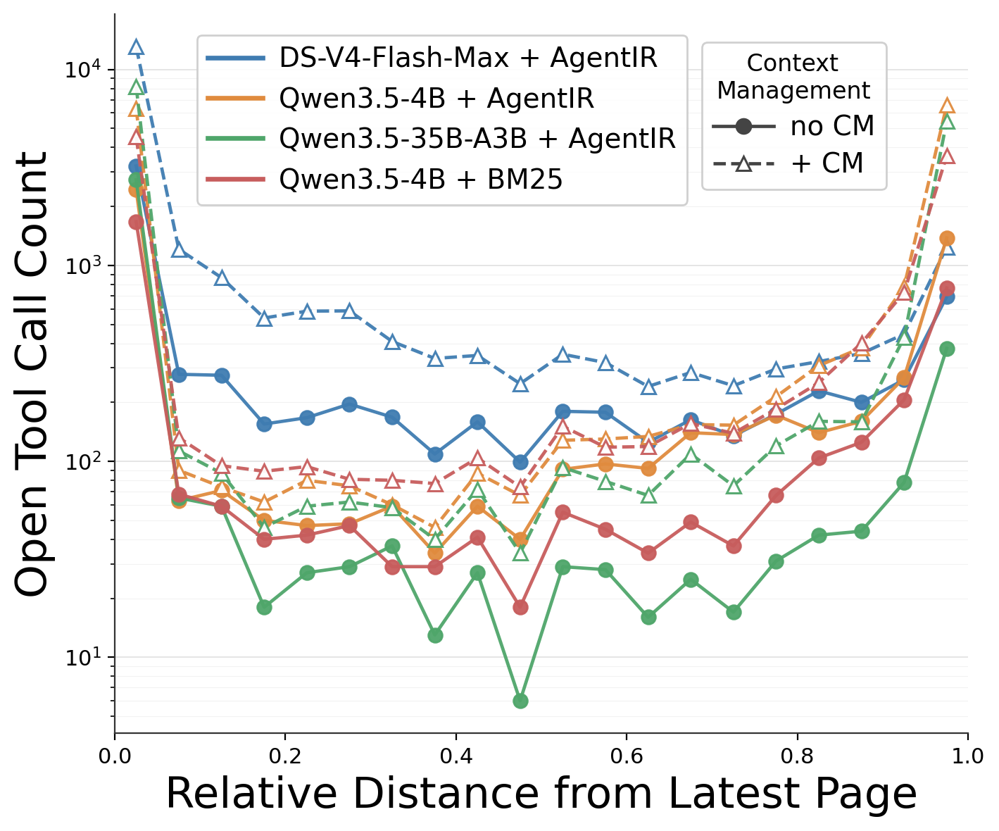

<h1 align="center">When Do Observations Become Essential in Deep Search?</h1>

<p align="center">
  <strong>Observation masking provides a narrow but informative lens on when context management helps, when retrieval is the bottleneck, and when saturated models start losing crucial evidence.</strong>
</p>

<div align="center">
  <a href="x.com"></a>
  <a href="https://github.com/i-DeepSearch/observation-masking"></a>
  <a href="./"></a>
  <a href="https://huggingface.co/datasets/i-DeepSearch/observation-masking-eval-logs"></a>
</div>

## Regime Overview

<div align="center">
  
</div>

Deep search agents accumulate long observation traces while iterating through reasoning, search, and browsing. We study **observation masking** as a simple context-management (CM) intervention and find that its effect is highly regime-dependent across model-retriever pairs.


<details>
<summary><strong>Main Results</strong></summary>

<br>

<div align="center">
  
</div>
CM adds little when the retriever is the bottleneck, because the context contains too little answer-supporting evidence to rescue. It helps most in the middle regime, where useful signals are sparse and masking removes noise that the model cannot yet filter. Once the base model is saturated, aggressive masking can collapse performance by evicting crucial evidence during long trajectories.

</details>

## Features

- **Model Compatibility**: seamless support for [Qwen3.5](https://huggingface.co/Qwen/Qwen3.5-9B) / [Qwen3.6](https://huggingface.co/Qwen/Qwen3.6-35B-A3B) Family, [DeepSeek-V4-Flash](https://huggingface.co/deepseek-ai/DeepSeek-V4-Flash), [NVIDIA Nemotron 3](https://huggingface.co/nvidia/NVIDIA-Nemotron-3-Nano-30B-A3B-BF16), and [GPT-OSS](https://huggingface.co/openai/gpt-oss-120b).
- **Parallel Tool Calls**: optional parallel browser/search execution for models that benefit from multi-tool-call planning according to their native tool-calling template ([Qwen3](https://huggingface.co/Qwen/Qwen3.5-35B-A3B/blob/main/chat_template.jinja), [DeepSeek-V4-Flash](https://huggingface.co/deepseek-ai/DeepSeek-V4-Flash/tree/main/encoding), [NVIDIA Nemotron 3](https://huggingface.co/nvidia/NVIDIA-Nemotron-3-Nano-30B-A3B-BF16/blob/main/chat_template.jinja), and [GPT-OSS](https://huggingface.co/openai/gpt-oss-120b/blob/main/chat_template.jinja)).
- **Configurable Masking Window**: freely choose the window size for retaining or archiving stale observations.
- **Flexible Search Backend**: use local BM25, Qwen3-Embedding-8B, or AgentIR retrieval for BrowseComp-Plus, and Serper-backed web search for live-web benchmarks.
- **Trajectory Preservation**: keep full saved trajectories for analysis even when observations are masked or archived in the active model context.

## 🛠 Recommended Environment
+ More/Better than 8 * A100 80G Nvidia GPUs on one node
+ Linux 
+ CUDA 12.2 or higher (if you need to run Qwen3.5/3.6 and DeepSeek-V4, you will need CUDA 13.1 or higher)

### One-click setup

One-click setup (optional, you can also install dependencies manually):

```bash
bash setup.sh
```

### Manual Installation 
```bash
# Optional: system-wide OpenJDK 21, only if you have sudo.
sudo apt update 
sudo apt install -y openjdk-21-jdk

# No sudo? Skip the apt commands above.
# setup.sh will download OpenJDK 21 into ./.jdk/jdk-21 when needed.

# install uv
curl -LsSf https://astral.sh/uv/install.sh | sh
uv venv --python 3.12
source .venv/bin/activate

# install tevatron for BrowseComp-plus 
git clone https://github.com/texttron/tevatron.git
cd tevatron
uv pip install -e .
cd ..

# install all dependencies automatically
uv pip install -e .
```

Configure API keys for Serper-backed benchmarks and evaluation:

```bash
cp .env.template .env

# Get API Key: https://serper.dev/
SERPER_API_KEY=your_serper_api_key_here

# OpenAI API for evaluation: https://platform.openai.com/api-keys
OPENAI_API_KEY=your_openai_api_key_here
```

## Deploy Search

BrowseComp-Plus uses a local search service on custom ports. 

**Attention**: The dense and AgentIR search service will occupy about 10G of your GPU.

```bash
# BM25
bash scripts/start_search_service.sh bm25 8005

# Dense (Qwen3-Embedding-8B)
bash scripts/start_search_service.sh dense 8006

# AgentIR
bash scripts/start_search_service.sh agentir 8007
```

## Deploy Models

### GPT-OSS-20B

```bash
bash scripts/start_gptoss_servers.sh \
  8010 \
  "2,3,4,5,6,7" \
  "openai/gpt-oss-20b" \
  "0.95,0.95,0.95" \
  2 \
  32
```
This starts 3 two-GPU TP replicas on ports `8010` through `8012`.

### Qwen3.5-9B (CUDA ≥ 13 required)

```bash
uv venv qwen35 --python 3.12
uv pip install vllm \
  --torch-backend=auto \
  --extra-index-url https://wheels.vllm.ai/nightly \
  --python qwen35/bin/python

bash scripts/start_qwen_servers.sh \
  8010 \
  "1,2,3,4,5,6,7" \
  "Qwen/Qwen3.5-9B" \
  "0.95,0.95,0.95,0.95,0.95,0.95,0.95" \
  1 \
  32
```

This starts 7 single-GPU replicas on ports `8010` through `8016`.

For Qwen3.5/3.6-35B, GPT-OSS-120B, DeepSeek-V4-Flash, and NVIDIA Nemotron 3 deployment recipes, see [`assets/docs/deployment.md`](assets/docs/deployment.md).

## Run

### BrowseComp-Plus with AgentIR and GPT-OSS-20B

Start AgentIR search on port `8003`, then run GPT-OSS-20B against BrowseComp-Plus:

```bash
bash scripts/start_search_service.sh agentir 8003

SEARCH_URL="http://localhost:8003" bash run_agent.sh \
  results/browsecomp-plus/gptoss-20b-agentir \
  8010 \
  3 \
  browsecomp_plus \
  local \
  "openai/gpt-oss-20b" \
  10000 \
  "" \
  on
```

### BrowseComp-ZH with Serper, Observation Masking and Qwen3.5-9B

Serper-backed benchmarks do not need a local search service. Make sure `SERPER_API_KEY` is set in `.env`.

```bash
bash run_agent.sh \
  results/browsecomp-zh/qwen3.5-9b-serper \
  8010 \
  7 \
  browsecomp-zh \
  serper \
  "Qwen/Qwen3.5-9B" \
  4 \
  "" \
  on
```

## Evaluation

```bash
python eval.py --input_dir results/browsecomp-plus/gptoss-20b-agentir --model_name_or_path openai/gpt-oss-20b

python eval.py --input_dir results/browsecomp-zh/qwen3.5-9b-serper --model_name_or_path Qwen/Qwen3.5-9B
```

For full script arguments, see [`assets/docs/parameter.md`](assets/docs/parameter.md).

## Scaffold

<div align="center" style="background-color: white; padding: 16px; border-radius: 8px;">
  
</div>

We decouples browser execution from model serving: a shared browser pool handles search, page opening, and observation collection, while model workers consume the resulting trajectories through configurable masking windows. This makes it easy to compare model-retriever pairs under the same browsing environment and CM policy.

## Benchmarks

| Benchmark | Key | Size | Language | Search Backend |
|-----------|-----|------|----------|----------------|
| [BrowseComp-Plus](https://arxiv.org/abs/2508.06600) | `browsecomp_plus` | 830 | EN | local |
| [BrowseComp-ZH](https://arxiv.org/abs/2504.19314) | `browsecomp-zh` | 289 | ZH | serper |
| [GAIA-text](https://arxiv.org/abs/2311.12983) | `gaia` | 103 | EN | serper |
| [xbench-DeepSearch](https://huggingface.co/datasets/xbench/DeepSearch) | `xbench` | 100 | ZH | serper |

For benchmark notes, see [`assets/docs/benchmarks.md`](assets/docs/benchmarks.md).

## Analysis & Findings

<details>
<summary><strong>Sparse Signal and Complex Inputs</strong></summary>

<br>

<div align="center">
  
</div>

Observation masking (CM) helps most when the useful signal is sparse and the input trace is complex. Each point represents a sampled No-CM input prefix: the x-axis is the first principal component over input-trace features, where larger values indicate greater complexity, and the y-axis is the normalized fitted SNR. Green points are CM-rescued cases, while red points are unchanged cases. Saturated models show more separable rescued subsets, whereas retriever bottlenecks weaken the baseline signal and sharply suppress that separability.

</details>

<details>
<summary><strong>Attention to Stale Observations</strong></summary>

<br>

<div align="center">
  
</div>

Masking stale observations is relatively safe because models do not attend to them extensively. The left panel separates attention in a single trajectory into reasoning tokens and observation tokens. The middle panel aggregates attention-weight distributions by relative position across input contexts of different lengths. The cumulative attention-share bars summarize the mean share at each step across the three models.

</details>

<details>
<summary><strong>Page Reopening Behavior</strong></summary>

<br>

<div align="center">
  
</div>

Agents reopen middle pages much less often. The figure shows the relative positions of open targets in the current page pool, where CM sharpens the U-shaped pattern: agents tend to revisit early or recent pages more often than pages in the middle of the pool.

</details>

## i-DeepSearch Team

We are grateful for all the help we got from our contributors.

<table>
	<tbody>
		<tr>
            <td align="center">
                <a href="https://isaacghx.github.io/about/">
                    
                    <br />
                    <sub><b>Haoxiang Zhang</b></sub>
                </a>
            </td>
            <td align="center">
                <a href="https://scholar.google.com/citations?user=AvbV0HcAAAAJ&hl=en">
                    
                    <br />
                    <sub><b>Qixin Xu</b></sub>
                </a>
            </td>
            <td align="center">
                <a href="https://zhuofeng-li.github.io/">
                    
                    <br />
                    <sub><b>Zhuofeng Li</b></sub>
                </a>
            </td>
            <td align="center">
                <a href="https://yusalei.github.io/">
                    
                    <br />
                    <sub><b>Lei Zhang</b></sub>
                </a>
            </td>
        </tr>
        <tr>
            <td align="center">
                <a href="https://pat-jj.github.io/">
                    
                    <br />
                    <sub><b>Patrick Jiang</b></sub>
                </a>
            </td>
            <td align="center">
                <a href="https://yuzhimanhua.github.io/">
                    
                    <br />
                    <sub><b>Yu Zhang</b></sub>
                </a>
            </td>
            <td align="center">
                <a href="https://cseweb.ucsd.edu/~jmcauley/">
                    
                    <br />
                    <sub><b>Julian McAuley</b></sub>
                </a>
            </td>
        </tr>
      	<tbody>
</table>

## Acknowledgements

<p align="center">
  <a href="https://ucsd.edu/"></a>&nbsp;&nbsp;&nbsp; <a href="https://www.berkeley.edu/"></a>&nbsp;&nbsp;&nbsp; <a href="https://www.tamu.edu/"></a>&nbsp;&nbsp;&nbsp; <a href="https://illinois.edu/"></a>
</p>

We also thank the following open-source projects:
- [vLLM ](https://github.com/vllm-project/vllm) for fast LLM inference support.
- [OpenResearcher](https://github.com/TIGER-AI-Lab/OpenResearcher) for early-stage exploration in scaffold-building and deep search benchmark collection.
- [DeepSeek-AI](https://huggingface.co/deepseek-ai), [Qwen-AI](https://huggingface.co/Qwen), and [OpenAI GPT-OSS Team](https://huggingface.co/openai) for their marvelous open-weight models.


## Citation

```bibtex
@article{zhang2026masking,
  title={Masking Stale Observations Helps Search Agents -- Until It Doesn’t: A Regime Map and Its Mechanism},
  author={Zhang, Haoxiang and Xu, Qixin and Li, Zhuofeng and Zhang, Lei and Jiang, Pengcheng and Zhang, Yu and McAuley, Julian},
  year={2026}
}
```
